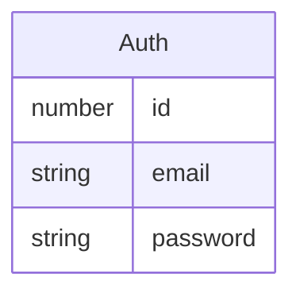

# grpc-nest-auth-svc

A microservice for auth

## package

```shell
yarn add @nestjs/microservices @nestjs/typeorm @nestjs/jwt @nestjs/passport passport passport-jwt typeorm pg class-transformer class-validator bcrypt @hapi/joi
yarn add -D @types/node ts-proto @types/bcrypt @types/hapi__joi
```

## add script

```json
{
  "proto:install": "yarn add git+https://github.com/yuanyu90221/grpc-nest-proto.git",
  "proto:auth": "protoc --plugin=node_modules/.bin/proto-gen-ts_proto -I=./node_modules/grpc-nest-proto/proto --ts_proto_out=src/auth/ node_modules/grpc-nest-proto/proto/auth.proto --ts_proto_opt=nestJs=true --ts_proto_opt=fileSuffix=.pb"
}
```

## entity

