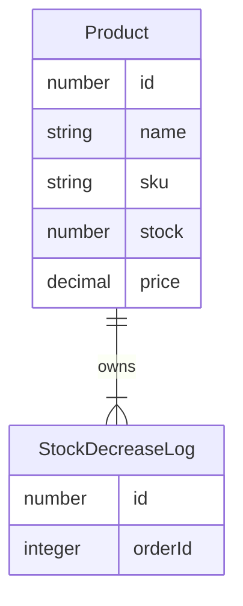

# grpc-nest-product-svc

A microservice for product

## package

```shell=
yarn add @nestjs/microservices @nestjs/typeorm @nestjs/jwt @nestjs/passport passport passport-jwt typeorm pg class-transformer class-validator bcrypt @hapi/joi
yarn add -D @types/node ts-proto @types/bcrypt @types/hapi__joi
```

## entity


